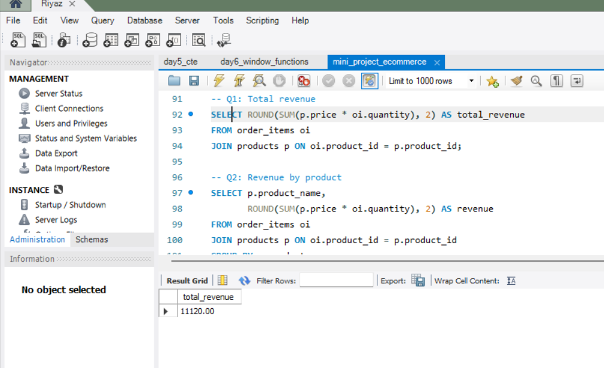
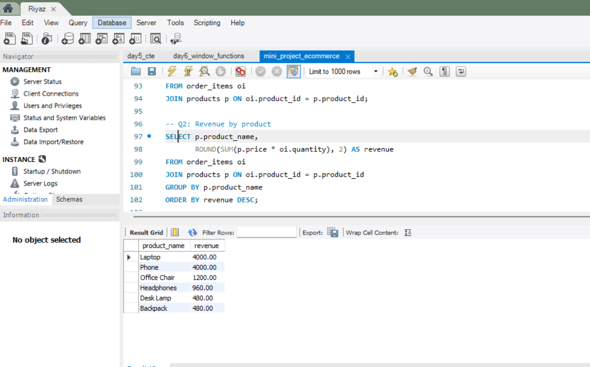
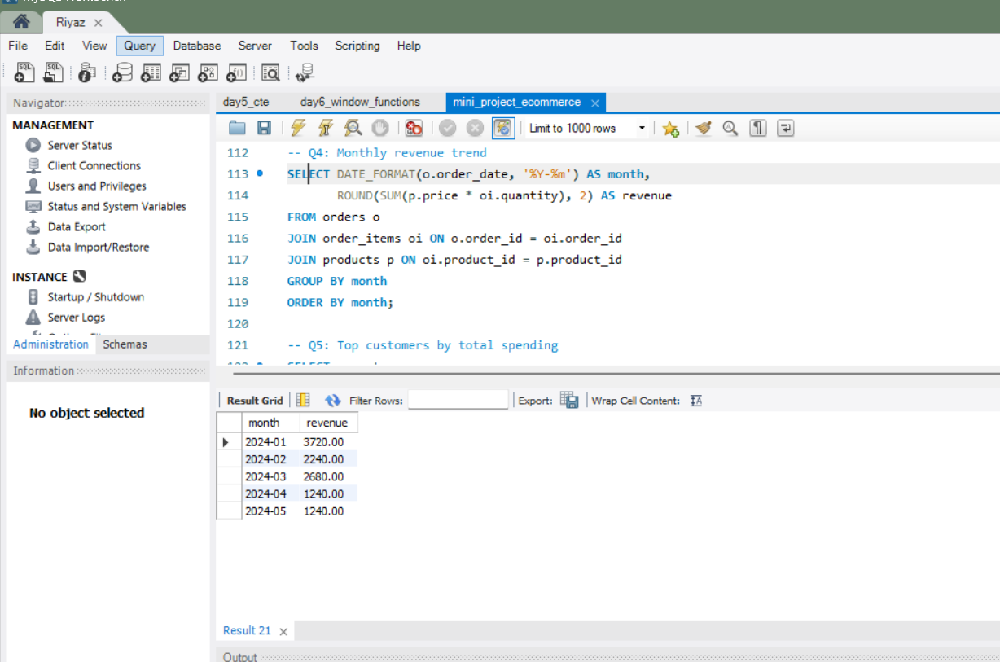
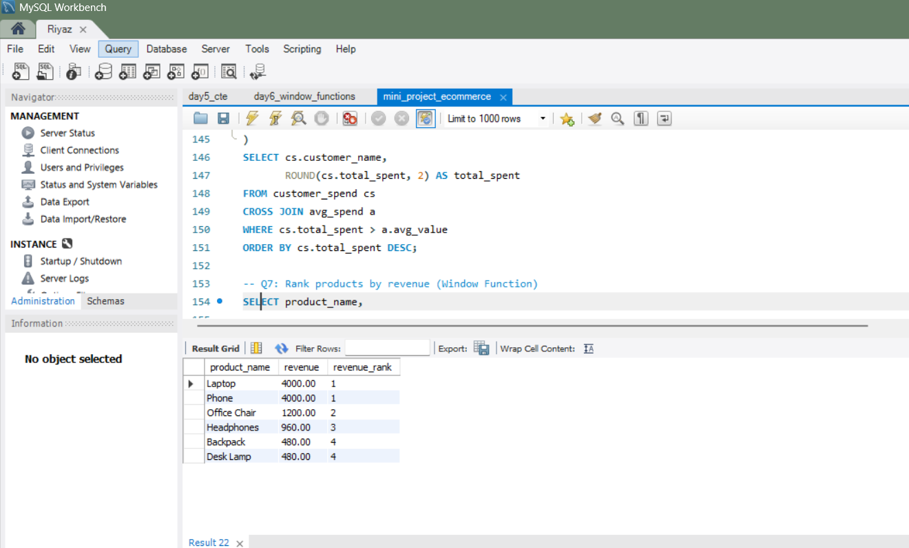

-- ============================================

-- E-commerce SQL Analysis Mini Project
-- Author: Reyaz
-- MySQL Version: 8.0
-- Concepts: JOIN, GROUP BY, Subqueries, CTE, Window Functions

-- ============================================

# 🛒 E-commerce SQL Analysis Project

## 📌 Objective
Analyze a relational e-commerce database to generate revenue insights, customer behavior patterns, and product performance metrics using MySQL.

---

## 🗄 Database Schema

Tables Used:
- customers
- products
- orders
- order_items

Relationships:
- customers → orders (1-to-many)
- orders → order_items (1-to-many)
- products → order_items (1-to-many)

---

## 📊 Key Business Questions Answered

1. What is the total revenue?
2. Which products generate the highest revenue?
3. What is the monthly revenue trend?
4. Who are the top customers by spending?
5. Which customers spend above average?
6. How do products rank by revenue?

---

## 💰 Total Revenue

Total Revenue Generated: **$11,120**

---

## 📦 Revenue by Product

- Laptop and Phone are the top revenue contributors.
- High-priced electronics dominate total revenue.

---

## 📅 Monthly Revenue Trend

- Revenue peaked in January 2024.
- Sales trend shows variability across months.

---

## 🏆 Product Revenue Ranking

- Laptop and Phone tied for rank #1.
- Revenue distribution indicates strong multiple product performance.

---

## 🛠 SQL Concepts Applied

- INNER JOIN
- GROUP BY & HAVING
- Subqueries
- CTE (WITH clause)
- Window Functions (DENSE_RANK)

---

## 🚀 Key Insight

Revenue is concentrated in high-value electronic products, with early-year sales driving the highest performance. Customer spending shows an uneven distribution, highlighting a small set of repeat high-value customers.
